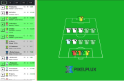

# Fantasy football hackaton

In this hackaton goal was to create a simple app that will simulate a fantasy football software.

This is based on react.js, and build in 1 day.

## Demo online

You can see the demo here: https://torabian.github.io/fantasy-football

## Credits

This is build by Ali Torabi you can us at https://pixelplux.com